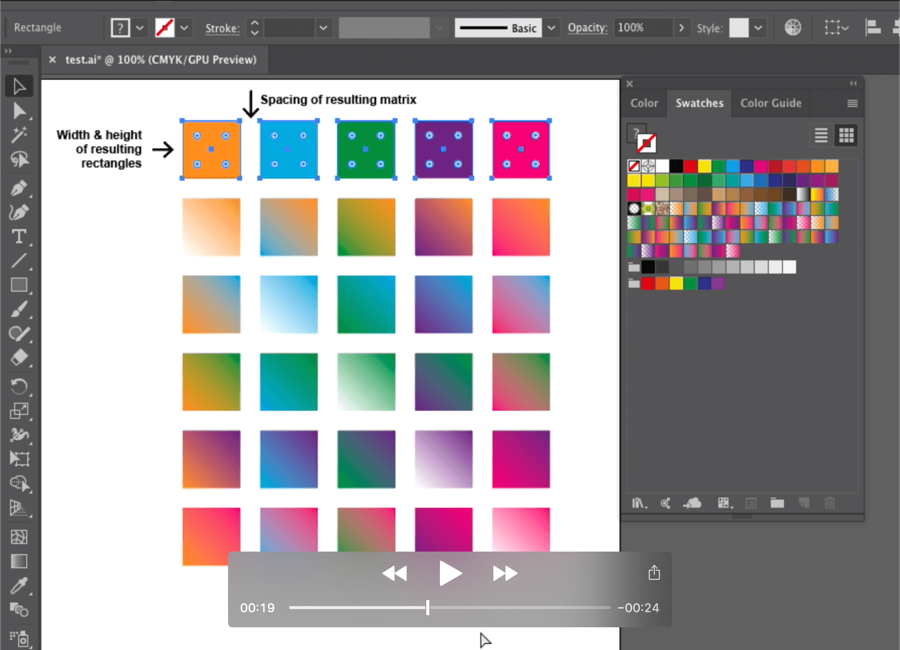

# Gradient matrix generator for Adobe Illustrator

Adobe Illustrator script that generates a matrix of gradient combinations from a selection of colors.

## Installation

Download the `generate-gradient-matrix-illustrator.jsx` file and save it somewhere in your computer.

### Usage

[Click to watch](https://youtu.be/0UknL4fJ0Ls) the video below (54s.)

1. Draw as many rectangles as many colors you want to combine.
2. Fill them with the corresponding colors
3. Select the elements you want to combine (at least two)
3. Goto the Illustrator menu option: `File / Script / Other script` and select the file `generate-gradient-matrix-illustrator.jsx`. You can also drag & drop this file to the Illustrator artboard.
5. You'll get the resulting gradients below the selection.
6. Gradient swatches will be added to the `Color Swatches palette`.

You can take a look to the sample `test.ai` file in this repository.

### Configuration and tweaks

- The spacing between the gradient's matrix elements will be the same as the **spacing between the first two elements in the selection.**
- The proportions of the resulting rectangles will be the same proportions of the **first element in the selection.**
- You can get circles instead of squares / rectangles simply **rounding the resulting shapes corners.**

### Info & feedback

This is a fast-and-dirtty adaptation from an [Sketch plugin of my own](https://github.com/carloscabo/gradient-matrix-generator-sketch), don't expect superb-fancy-state-of-the-art coding. If you have any questions / suggestions you can find me at Twitter ([@putuko](https://twitter.com/putuko)). This is an open source plugin so pull request and collaborations are welcome. Greetz.